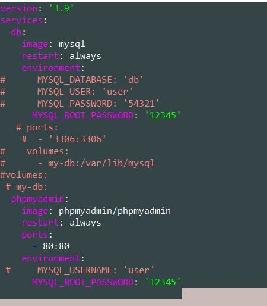
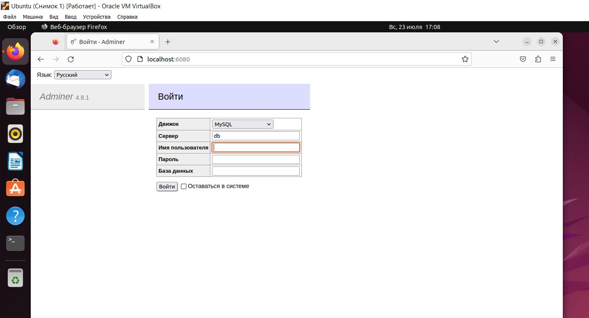
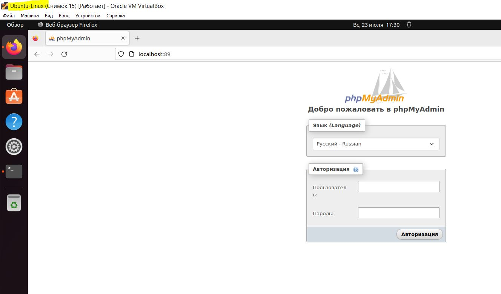

# Урок 5. Docker Compose и Docker Swarm
## Classwork
Знакомились с работой Docker Compose и Docker Swarm
## Homework 
### Задание 1:
1) создать сервис, состоящий из 2 различных контейнеров: 1 - веб, 2 - БД
2) далее необходимо создать 3 сервиса в каждом окружении (dev, prod, lab)
3) по итогу на каждой ноде должно быть по 2 работающих контейнера
4) выводы зафиксировать

### Задание 2*:
1) нужно создать 2 ДК-файла, в которых будут описываться сервисы
2) повторить задание 1 для двух окружений: lab, dev
3) обязательно проверить и зафиксировать результаты, чтобы можно было выслать преподавателю для проверки

Задание со звездочкой - повышенной сложности, это нужно учесть при выполнении (но сделать его необходимо).

### или (если нет возможности создать вторую node)
1) Создать 2 ДК-файла, в которых будут описываться сервисы состоящие из двух контейнеров: 1 - веб, 2 - БД
2) Сделать реплики контейнеров воспользовавшись сервисом Docker Swarm;
3) Проверить работоспособность контейнеров.

**Первый вариант решение(без использования второй node):**

Создаем два ДК-файла:

Компилируем node:

Проверяем:

Пытаемся задеплоить в Stack:

Получаем ошибку: "версия данного файла не поддерживается", продолжаем делать, как делали на семинаре.
Запускаем первый ДК-файл:

Проверяем:

Запускаем второй ДК-файл:

Воспользуемся функционалом Docker Swarm и создадим дубликат одного и того же образа:

Аналогично можем проделать с другими образами, далее повязать их сетью и получить полные дубликаты: БД + WEB.

**Второй вариант решение(с использованием второй node):**

Подключаемся по SSH ко второй VM и устанавливаем swarm соединение, предварительно инициализировав manager node:

Запускаем первый ДК-файл на manager node:

Проверяем:

Запускаем второй ДК-файл на worker node:

Проверяем:

Попробуем запустить первый ДК-файл на node worker:

Проверяем, все работает, ошибки дублирования не произошло т. к имена image разные(ДК-файлы в разных директориях 
находятся на VM)

Запускаем на manager node второй ДК-файл и получаем четыре работающих контейнера на одной node и на другой
(не считая hello-word):

Если бы расположение папок было идентично на manager node и worker node, пришлось бы создавать реплики образов и 
обвязывать их сетью:

Тем временем наблюдаем за статусом worker node, он "упал"(Отказался идти на повышение). Переподключаем swarm соединение:

Создаем еще реплики образов и видим как система их перераспределяет:

Для того чтобы сервисы распределять на определенные ноды необходимо применять labels
(подробнее об этом тут: https://habr.com/ru/articles/659813/)

*Подготовил студент* [**`Серикова Мария`**]
